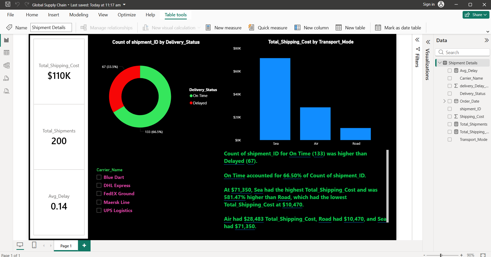

# 🌐 Global Supply Chain & Shipment Tracker (Power BI)

A dark-themed logistics intelligence dashboard designed to audit delivery constraints, carrier performance, and international shipping costs.

## 🚀 Key Performance Indicators (KPIs)
* **Total Shipping Cost:** $110K
* **Total Shipments Managed:** 200
* **Average Delivery Delay:** 0.14

## 🔍 Core Visual Insights
* **Logistics Accuracy:** Pie chart breaking down delivery statuses (66.5% On Time vs 33.5% Delayed shipments).
* **Transportation Modes:** Bar chart tracking financial spend allocation across Sea, Air, and Road freight.
* **Carrier Analytics:** Slicers auditing performance metrics for major logistics partners (DHL, Blue Dart, FedEx, Maersk).

## 🛠️ Tech Stack & Methodology
* **BI Tool:** Power BI Desktop
* **Design Pattern:** Custom Dark Mode UI for enterprise dashboard deployment.
* **Analytics:** Supply Chain Performance KPI Metrics.

---

## 📷 Dashboard Screenshot

